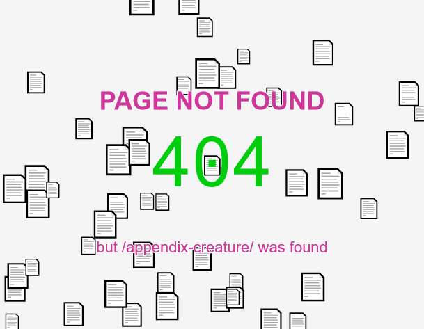

# 404 Page Not Found with Interactive Emojis



[Sketch available at p5.org editor](https://editor.p5js.org/ajuancer/sketches/L_3kqVNYQ)

[Preview available at p5.org editor](https://editor.p5js.org/ajuancer/full/L_3kqVNYQ)

This project is a creative and interactive "404 Page Not Found" display using p5.js. It features animated emojis that bounce around the screen. When an emoji passes through the center of the "0" in "404", the color of the "404" changes progressively, and a message displays indicating which emoji was found  (each emoji is associated with one endpoint). Users can also drag the emojis around the screen.

## Features
- Animated bouncing emojis (📄).
- Progressive color change of the "404" icon when an emoji passes through its center.
- Dynamic message update based on which emoji passes through the center. Each emoji is associated with one endpoint defined in the `endpoints.json`
- User can drag emojis with the mouse.
- Cursor changes to a hand when hovering over an emoji.
- (Optional) Blurred background for text to ensure readability. Uncomment line `drawBlurredTextBackground();`
- (Optional) Show the current endopint -> the page that was not found. View the `getEndpointFromURL()` method for details and possible workaround. `drawTextWithOutline(endpoint, width / 2, height / 2 + 70, 22);`  is commented because it displays the url of the preview iframe of the p5 editor.

## Configuration files
- `sketch.js`: p5.js script for the animation and interactions.
- `endpoints.json`: JSON file containing endpoint strings associated with each emoji.

## JSON Structure
The `endpoints.json` file should have the following structure:

```json

{
  "endpoints": [
    "test",
    "cheese",
    "settings",
    "example",
    ...
  ]
}
```

## p5.js Script (`sketch.js`)
The p5.js script handles the following:
### Variables
- `emojis`: Array to store emoji objects.
- `iconX`, `iconY`: Coordinates for the "404" icon.
- `iconColor`: Color of the "404" icon, which changes based on emoji interaction.
- `emojiFoundText`: Message displayed based on emoji 
- `endpointsData`: Array loaded from the JSON 
- `endpoint`: Current URL 
- `draggedEmoji`: Emoji being dragged by the user (if any).
- `pageNotFoundText`: The not found message displayed
- `redColor`, `greenColor`: Store the colors defined in setup
- `lerpAmount = 0.5;` // Amount of interpolation (between 0 and 1)
- `velocity`: Of the icons moving around the screen
- `density`: Number of emojis
- `textGraphics`: Graphics buffer for blurred background

### Setup
- Preload the endpoints.json file.
- Initialize the canvas, text alignment, icon coordinates, and colors.
- Extract the endpoint from the URL.
- Initialize emojis with their respective endpoint strings.
- Create a graphics buffer for the blurred background.

### Draw
- Clear the background.
- Update and display emojis.
- Check if any emoji passes through the center of the "404" zero.
- Change the color of the "404" icon progressively and update the message accordingly.
- Draw the "404" icon.
- Draw the blurred background for the text.
- Display the endpoint, "Page Not Found", and dynamic message with text outline.

### Emoji Class
Handles the behavior and display of each emoji:
- Constructor initializes `position`, `size`, `speed`, `endpoint`, and dragging state.
- `update` method updates position based on speed and canvas boundaries.
- `display` method draws the emoji.
- `mousePressed`, `mouseReleased`, and `drag` methods handle dragging behavior.
- `isHovered` method checks if the mouse is hovering over the emoji.

### Mouse Events
- `mousePressed`, `mouseReleased`, and `mouseDragged` handle dragging of emojis.
- `mouseMoved` changes the cursor to a hand when hovering over an emoji.